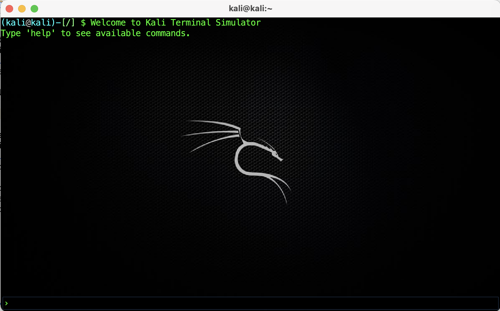
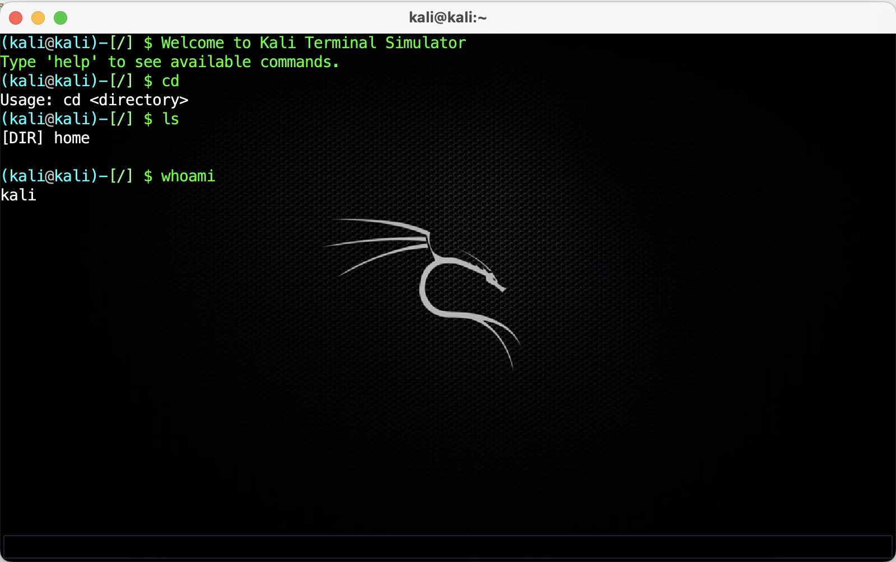
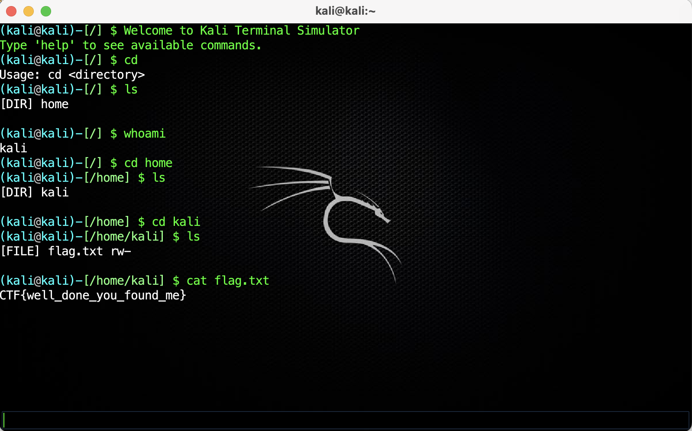

# Kali Terminal Simulator

A **Java Swing application** that simulates a Linux-like terminal environment with a virtual file system, command execution, and styled terminal output.


*Figure 1: Kali Terminal UI*

---

### 📋 Features

- Realistic **Linux-style terminal interface** with green-on-black theme
- Custom **blinking caret** (cursor) effect
- Built-in **virtual file system** (with directories, files, and permissions)
- Supports **command execution** including:  
  - File navigation: `pwd`, `ls`, `cd`
  - File management: `cat`, `touch`, `rm`, `cp`, `mv`, `chmod`, `chown`
  - Utilities: `grep`, `head`, `tail`, `diff`, `sort`
  - System commands: `whoami`, `uname`, `date`, `cal`, `man`, `shutdown`, `reboot`
- Supports **input/output redirection** with `>` and `>>`
- Includes a hidden `flag.txt` for **CTF-style challenges** 🎯

---

### 🛠️ Technologies Used

- **Java 8+**
- **Swing** (UI)
- **AWT** (Graphics & Event Handling)
- **OOP Principles** (Encapsulation, Composition, Abstraction)

---

### 💻 Installation & Usage

1. Clone the repository**

```bash

git clone https://github.com/YaseenKannemeyer/Linux-Terminal-Java.git

```
2. Open in your Java IDE
(IntelliJ, NetBeans, or Eclipse)

3. Run TerminalApp.java
  - This is the main entry point.

4. Start typing commands just like in a Linux terminal.

---

### 🚀 How to Use

1. Launch the app → a Kali-styled terminal window opens.


2. Use commands like ls, pwd, cd home, cat flag.txt.


3. Try system utilities like man ls, grep pattern file.txt, or date.


*Figure 2: Testing Kali Terminal UI*


*Figure 3: Finding the hidden flag*

---

### ⚠️ Known Issues

While the Kali Terminal Simulator is functional and provides a realistic Linux terminal experience, there are a few known issues and limitations:

1. **Caret Blinking**
   - Restarting the terminal or clearing the screen may start multiple caret timers, causing faster-than-normal blinking over time.

2. **Terminal Prompt Display**
   - Command outputs currently include the prompt as part of the output, which differs slightly from a real Linux terminal where the prompt is separate.

3. **Redirection (`>` and `>>`)**
   - Simple splitting by `>` may fail for commands with quotes, spaces, or multiple redirection operators.
   - Commands like `echo "Hello World" > file.txt` may not behave as expected.

4. **Directory Move/Copy**
   - Moving or copying directories currently creates a new empty directory; the contents of the original directory are not preserved.

5. **Permissions and Ownership**
   - `chmod` replaces the file object rather than updating permissions directly.
   - `chown` is simulated and does not store ownership information.

6. **Command Input Limitations**
   - No support for command history (up/down arrow navigation).
   - No tab completion for files or directories.
   - Arguments containing spaces or special characters may not be handled correctly.

7. **Calendar Command**
   - The `cal` command only displays the first day of the current month rather than a full calendar.

8. **Diff Command**
   - When comparing files of different lengths, the output may include empty lines and may not align perfectly like the Linux `diff` command.

9. **UI/Threading**
   - Long-running commands execute on the Event Dispatch Thread (EDT), which can temporarily freeze the UI.
   - Background image paths are hard-coded and may not work across all platforms.

10. **Virtual File System Limitations**
    - No timestamps or detailed metadata for files.
    - Owner and group information is not stored.
    - Some commands (like `chown`) are placeholders for future enhancements.

We are actively working on addressing these limitations to provide a more complete and realistic terminal experience.

---

### 📞 Contact

- If you have questions or want to collaborate, feel free to reach out!

-- Email: yaseenkannemeyer@gmail.com

-- GitHub: YaseenKannemeyer

---

### 📄 License

This project is released into the public domain.

You are free to use, modify, distribute, and integrate this code into any project (personal or commercial).
Attribution is appreciated but not required.

© 2025 Mogamat Yaseen Kannemeyer
